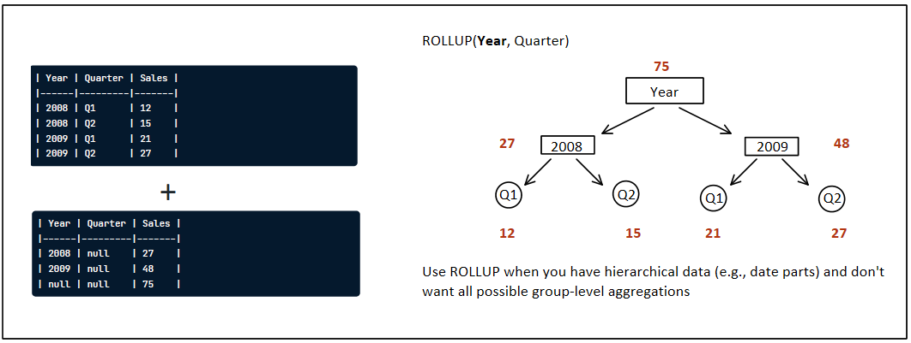
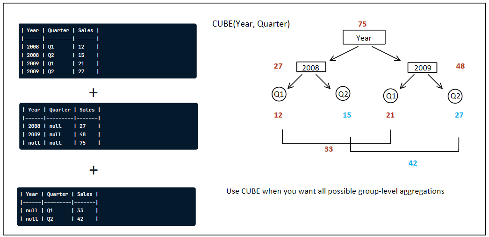

# :window: Window Functions
Perform an operation across a set of rows that are somehow related to the current row. similar to `GROUP BY` aggregate functions, but all rows remain in the output.

To tell SQL engine there is a Window function.. using `OVER()` (The Main function)
```sql 
FUNCTION_NAME() OVER(...)
```

Two main clauses Inside OVER function:
- `ORDER BY` orders the rows related to the current row
- `PARTITION BY` splits the table into partitions based on a column's unique values 

lets **Looking through the window** :grin:	

### :gear: Functions
- [Framing](#:wrench:Framing)
- [Fetching](#:wrench:Fetching)
- [Ranking](#:wrench:Ranking)
- [Paging](#:wrench:Paging)
- [Grouping](#:wrench:Grouping)

---

## :wrench: Framing
- `ROWS BETWEEN`
- `RANGE BETWEEN`

By default, a frame - starts at the beginning of a table or partition - ends at the current row

**MAX without a frame:**
`SUM(Medals) OVER (ORDER BY Year ASC) AS Max_Medals`

| Year | Medals | Max_Medals |
|------|--------|------------|
| 1996 | 36     | 36 	       |
| 2000 | 66     | 66 	       |
| 2004 | 47     | 66 	       |
| 2008 | 43     | 66	       |
| 2012 | 47     | 66 	       |

### 1. ROWS BETWEEN
```
ROWS BETWEEN [START] AND [FINISH]
```
```
  - n PRECEDING: n rows before the current row
  - CURRENT ROW: the current row
  - n FOLLOWING: n rows a
  
  - UNBOUNDED PRECEDING: the beginning of a table or partition
  - UNBOUNDED FOLLOWING: the end of a table or partition
```
**MAX with a ROWS frame:**
```sql MAX(Medals) OVER (ORDER BY Year ASC ROWS BETWEEN 1 PRECEDING AND CURRENT ROW) AS Max_Medals_Last```

| Year | Medals |Max_Medals_Last |
|------|--------|----------------|
| 1996 | 36     | 36 		   |
| 2000 | 66     | 66		   |
| 2004 | 47     | 66 		   |
| 2008 | 43     | 47		   |
| 2012 | 47     | 47 		   |

### 1. RANGE BETWEEN
RANGE treats duplicates in OVER's ORDER BY subclause as a single entity
```
RANGE BETWEEN [START] AND [FINISH]
```
```
  - n PRECEDING: n rows before the current row
  - CURRENT ROW: the current row
  - n FOLLOWING: n rows a
  
  - UNBOUNDED PRECEDING: the beginning of a table or partition
  - UNBOUNDED FOLLOWING: the end of a table or partition
```
**SUM with a RANGE frame:**
`SUM(Medals) OVER (ORDER BY Year ASC RANG BETWEEN UNBOUNDED PRECEDING AND CURRENT ROW) AS Range_RT`

| Year | Medals | Rows_RT | Range_RT |
|------|--------|---------|----------|
| 1992 | 10     | 10      | 10       |
| 1996 | 50     | 60      | 110      |
| 2000 | 50     | 110     | 110      |
| 2004 | 60     | 170     | 230      |
| 2008 | 60     | 230     | 230      |
| 2012 | 70     | 300     | 300      |


ROWS BETWEEN is almost always used over RANGE BETWEEN :sweat_smile:

---
### :wrench: Fetching
- Relative
  - `LAG(column, n)` returns column's value at the row n rows before the current row
  - `LEAD(column, n)` returns column's value at the row n rows after the current row
- Absolute
  - `FIRST_VALUE(column)` returns the first value in the table or partition
  - `LAST_VALUE(column)` returns the last value in the table or partition

``` sql
SELECT	Year, City,
	FIRST_VALUE(City) OVER(ORDER BY Year ASC) AS First_City,
	LAST_VALUE(City) OVER(ORDER BY Year ASC RANGE BETWEEN 
				                UNBOUNDED PRECEDING AND 
					        UNBOUNDED FOLLOWING ) AS Last_City
FROM Hosts
ORDER BY Year ASC
```
| Year | City      | First_City | Last_City |
|------|-----------|------------|-----------|
| 1896 | Athens    | Athens     | London    |
| 1900 | Paris     | Athens     | London    |
| 1904 | St Louis  | Athens 	| London    |
| 1908 | London    | Athens 	| London    |
| 1912 | Stockholm | Athens 	| London    |

:memo: **Note:**  
We used `RANGE BETWEEN` because we said that in the Window functions defintion, we Perform some operations that related to the current row, and we need the last value, that far away from the current row so we used: `RANGE BETWEEN` ... to extend the window to the end of the table or partition.

---
### :wrench: Ranking
- `ROW_NUMBER()` always assigns unique numbers, even if two rows' values are the same
- `RANK()` assigns the same number to rows with identical values, skipping over the next numbers in such cases
- `DENSE_RANK()` also assigns the same number to rows with identical values, but doesn't skip over the next numbers

:memo: **Note:**  
1. ROW_NUMBER and RANK will have the same last rank, the count of rows
2. DENSE_RANK's last rank is the count of unique values being ranked

| Country | Games | Row_N | Rank_N | Dense_Rank_N |
|---------|-------|-------|--------|--------------|
| GBR     | 27    | 1     | 1      | 1            |
| DEN     | 26    | 2     | 2      | 2            |
| FRA     | 26    | 3     | 2      | 2            |
| EBB     | 26    | 4     | 2      | 2            |
| ITA     | 25    | 5     | 5      | 3            |
| AUT     | 24    | 6     | 6      | 4            |
| BEL     | 24    | 7     | 6      | 4            |
| NOR     | 22    | 8     | 8      | 5            |
| POL     | 20    | 9     | 9      | 6            |
| ESP     | 18    | 10    | 10     | 7            |

---
### :wrench: Paging
- `NTILE(n)` splits the data into n approximately equal pages.  

[Paging](https://docs.microsoft.com/en-us/sql/t-sql/functions/ntile-transact-sql?view=sql-server-ver16): Splitting data into (approximately) equal chunks, uses:
  1. Many APIs return data in "pages" to reduce data being sent
  2. Separating data into quartiles or thirds (top middle 33%, and bottom thirds) to judge performance


---
### :wrench: Grouping
- `ROLLUP(column_1, column_2, ..)` hierarchical, de-aggregating from the leftmost provided column to the right-most
- `CUBE(column_1, column_2, ..)` a non-hierarchical ROLLUP, It generates all possible group-level aggregations





